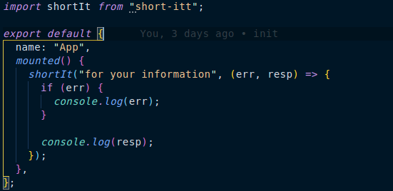
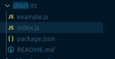
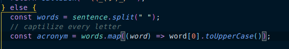
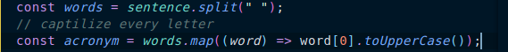
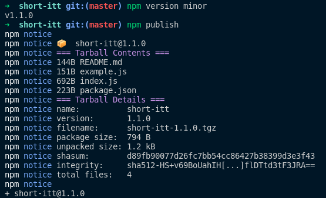
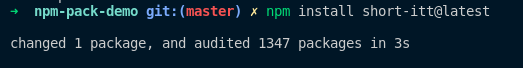

# NPM package POC (Prove Of Concept)

## NPM [full official docs](https://docs.npmjs.com/packages-and-modules)

---

## Packages used

1. [short-itt](https://github.com/safwat-fathi/short-itt) package.

## Changes history

1. using the package after publishing to NPM & installing it in our project.

2. update the package from **node_modules** within our project. Which will not make any diffrence in our package on NPM.

**Note: if these changes applied to the package codebase itself skip to step 4.**

3. copy the cahnges and paste it on our package codebase.

4. update package version.

---

**Note: that the package is entirley seperate from our codebase, meaning that any change made on package within node_modules directory must be copied & pasted by hand.**
